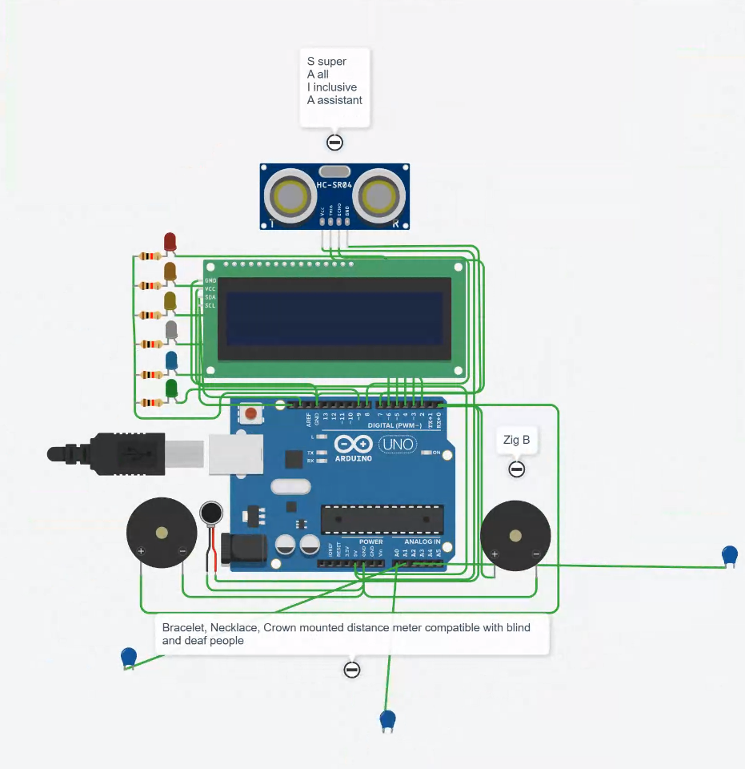

# SAIA
SAIA — Smart All Inclusive Assistant

Where innovation helps inclusive people.

- Those, who were blind, deaf and speechless will collaborate with everyone.
- Ongoing monitoring of vital life parameters.
- Easy to construct and use.
- Open source forever and ever.

# Stack and features:

- microcontroller (eg, Arduino or Raspberry, etc);
- modern OS;
- sine waves meter;
- glucose meter;
- blood pressure meter;
- pulse meter;
- leds;
- speakers;
- vibro engines;
- display;
- trackball for a thumb;
- small keyboard;
- bracelet;
- necklace;
- headband;
- ZigBee to connect with other #inclusion people.

Authors: Alex Voloshin, Dmitrii Pekhov
#SAIA #Inclusion
#Opensource #MrPekhov

March 2026
